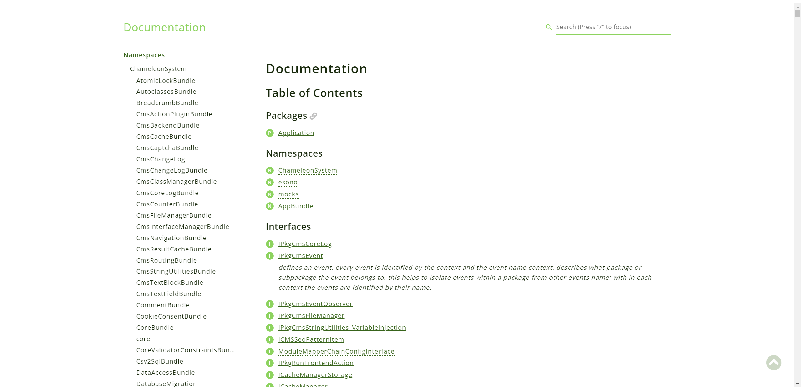

# Chameleon CMS Documentation

Welcome to the **Chameleon CMS Documentation** repository! This repository hosts the comprehensive documentation for the Chameleon Content Management System, organized into separate branches for each core component.


## 📚 Repository Structure

The documentation is organized into the following master branches:

- **[chameleon-base](https://github.com/chameleon-system/chameleon-base)**
- **[chameleon-shop](https://github.com/chameleon-system/chameleon-shop)**
- **[chameleon-system](https://github.com/chameleon-system/chameleon-system)**
---

## 🛠️ Generating Documentation

The documentation in this repository is generated using [phpDocumentor](https://www.phpdoc.org/). Below are the steps to generate and update the documentation:
 

**Push Documentation to GitHub**

   After generating the documentation, commit and push the changes:

   ```bash
   git add docs/api
   git commit -m "Update documentation for [component-name]"
   git push origin [branch-name]
   ```

---

## 📚 How to Use This Documentation

**Explore the Documentation**

   The directory contains the generated HTML documentation. Open the `index.html` file in your browser to browse the documentation.

   ```bash
   open index.html
   ```

   **Note:** Replace `open` with the appropriate command for your operating system if necessary.

---

## 🚀 Contributing

Contributions are welcome! If you find issues or have suggestions for improving the documentation, please follow these steps:

1. **Fork the Repository**

2. **Create a New Branch**

   ```bash
   git checkout -b feature/Improvement
   ```

3. **Make Your Changes**

4. **Commit Your Changes**

   ```bash
   git commit -m "Add improvements to [component] documentation"
   ```

5. **Push to Your Fork**

   ```bash
   git push origin feature/Improvement
   ```

6. **Submit a Pull Request**

---

## 🐟 License

This project is licensed under the MIT License.

---

